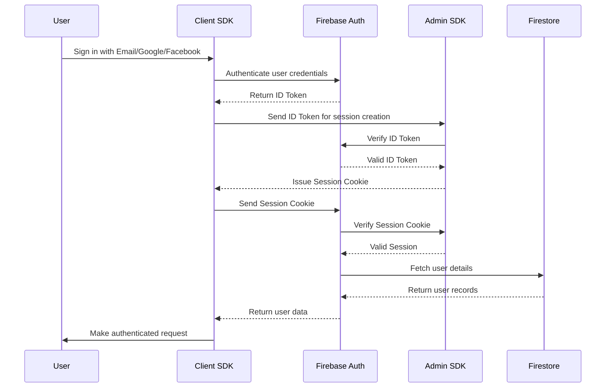
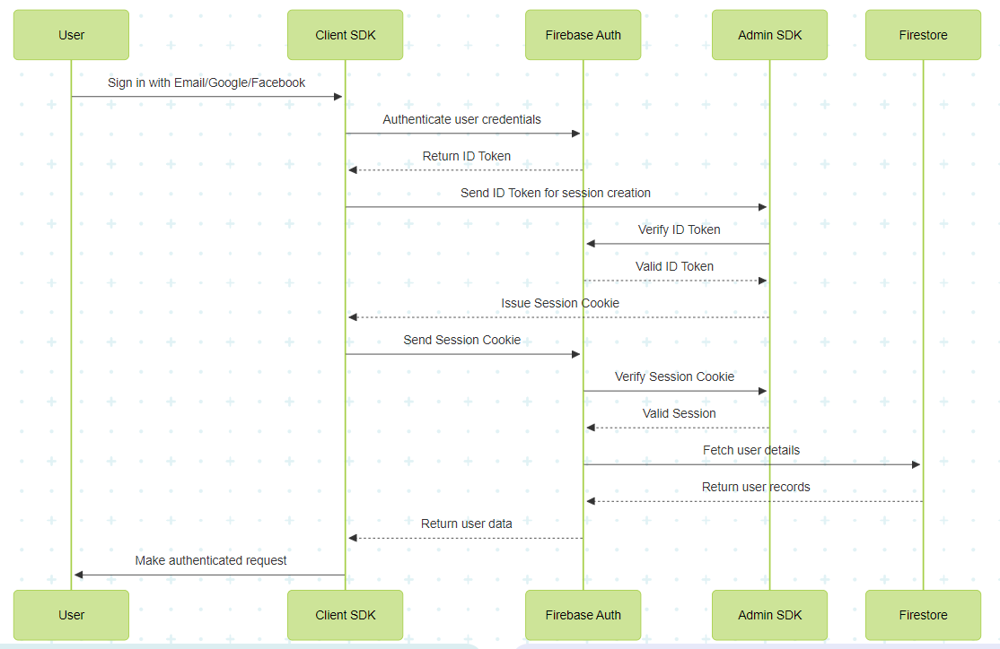

## Diagrama de Autenticación con Firebase usando Session Cookies

```mermaid
sequenceDiagram
    participant User
    participant Client SDK
    participant Firebase Auth
    participant Admin SDK
    participant Firestore

    User->>Client SDK: Sign in with Email/Google/Facebook
    Client SDK->>Firebase Auth: Authenticate user credentials
    Firebase Auth-->>Client SDK: Return ID Token
    Client SDK->>Admin SDK: Send ID Token for session creation
    Admin SDK->>Firebase Auth: Verify ID Token
    Firebase Auth-->>Admin SDK: Valid ID Token
    Admin SDK-->>Client SDK: Issue Session Cookie
    Client SDK->>Firebase Auth: Send Session Cookie
    Firebase Auth->>Admin SDK: Verify Session Cookie
    Admin SDK-->>Firebase Auth: Valid Session
    Firebase Auth->>Firestore: Fetch user details
    Firestore-->>Firebase Auth: Return user records
    Firebase Auth-->>Client SDK: Return user data
    Client SDK->>User: Make authenticated request
```
